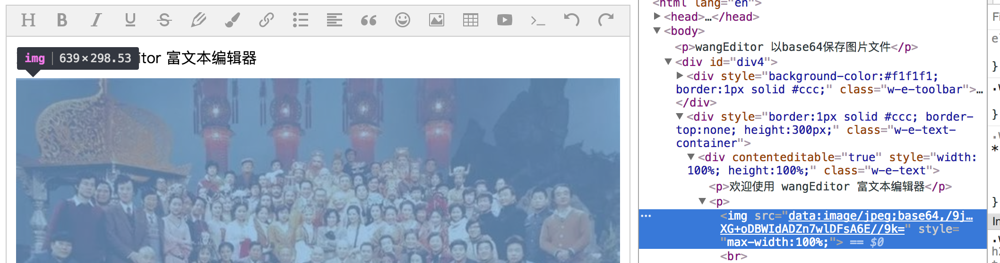

# Save Images in Base64 Format

Setting `editor.config.uploadImgShowBase64 = true` to save images in base64 format. That is, you can select a local image, and the editor will display the image in base64 format.

**Note:uploadImgShowBase64 (base64 format) and uploadImgServer (upload images to the server) cannot be used at the same time! ! !**

