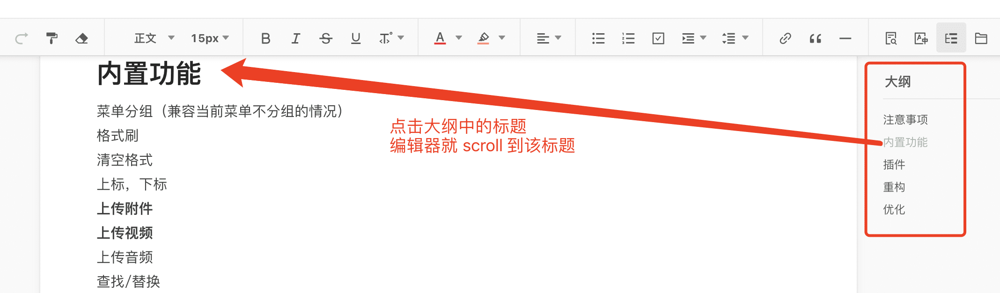

# Scroll to Head
As following figure, you can get all titles of editor content, and scrolling to specified title by using `editor.scrollToHead(headId)` API.



**Note it is supported from v4.5.0.**

## Get All Titles
You can get all titles of editor by listening `onCatalogChange` callback, if title changed, and it will trigger `onCatalogChange` callback.

```js
editor.config.onCatalogChange = function (headList) {
    /*
        headList format
        [
            { 
                id: "eold9", // title id
                tag: "H1",
                text: "text"
            },
            { ... },
            { ... }
        ]
    */

    // you can render it by yourself.
}
```

## Scroll to Specified Title
You can invoke `editor.scrollToHead(headId)` to scroll to specified title. Getting `headId` by id attr as above example format.

## Show Content
You can get html content by using `editor.txt.html()` API. The title is also with `id` attr. The format as follows:

```js
<h1 id="eold9">title1</h1>
<p>content</p>
<h2 id="nh339">title2</h2>
<p>content</p>
<h3 id="5mgwk">title3</h3>
<p>content</p>
```

In order to achieve the function of `scroll-to-head`, you can use these id for anchor when generating these content.