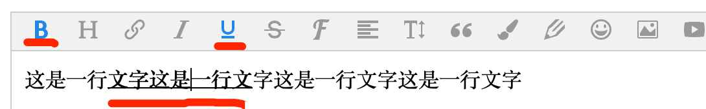

# quickly expand a menu

【Tip】Take the Button menu as an example to demonstrate. Other types of menus will be mentioned below, and the registration steps are the same.

# prepare

```
// import wangEditor
import E from 'wangeditor' // npm 
// const E = window.wangEditor // CDN

// Get the necessary variables, these will be used in the following
const { $, BtnMenu, DropListMenu, PanelMenu, DropList, Panel, Tooltip } = E

// 【Tip】if version <= v4.0.5 ：
// const { $ } = E
// const { BtnMenu, DropListMenu, PanelMenu, DropList, Panel, Tooltip } = E.menuConstructors
```

# Menu Class

```
// Menu class ，Button Extends BtnMenu class
class AlertMenu extends BtnMenu {
    constructor(editor) {
      // data-title indicates that when the mouse hovers over the button, the function of the button is prompted
        const $elem = E.$(
            `<div class="w-e-menu" data-title="Alert">
                <button>alert</button>
            </div>`
        )
        super($elem, editor)
    }
    // menu click event
    clickHandler() {
        // do what you want to do 
        // You can refer to the [Common API] document to operate the editor

        alert('hello world')
    }
    // Whether the menu is activated（If not needed, this function can be empty )
    // 1. What is activation? When the cursor is placed on a section of bold and underlined text, B and U in the menu bar are activated, as shown in the figure below
    // 2. When is this function executed? Every time the selection of the editor area changes (such as mouse operation, keyboard operation, etc.), the tryChangeActive function of each menu will be triggered to recalculate the activation state of the menu
    tryChangeActive() {
        //active menu
        // 1. the DOM node will add a .w-e-active css class
        // 2. this.this.isActive === true
        this.active()

        // // unactive menu 
        // // 1. the DOM node will remove .w-e-active css class
        // // 2. this.this.isActive === false
        // this.unActive()
    }
}
```



# Register Menu

```
const editor = new E('#div1')

// register menu 
const menuKey = 'alertMenuKey' // menu key ，must be unique

editor.menus.extend('alertMenuKey', AlertMenu)

// put menu in  editor.config.menus 
// You can also adjust the order of the menus through the configuration menus, refer to the document in the [Configuration Menu] section
editor.config.menus = editor.config.menus.concat(menuKey)

// After registering the menu, then create the editor, the order is very important
editor.create()

```


# TypeScript 

In the next document, when you refer to the source code to develop  DropList, Panel, Tooltip, if you use TypeScript to develop, you may use some built-in types of wangEditor, which can be obtained in this way

【Tip】 wangEditor version >= v4.0.6 。

```
import { DropListConf, DropListItem, PanelTabConf, PanelConf, TooltipConfItemType } from 'wangeditor'
```