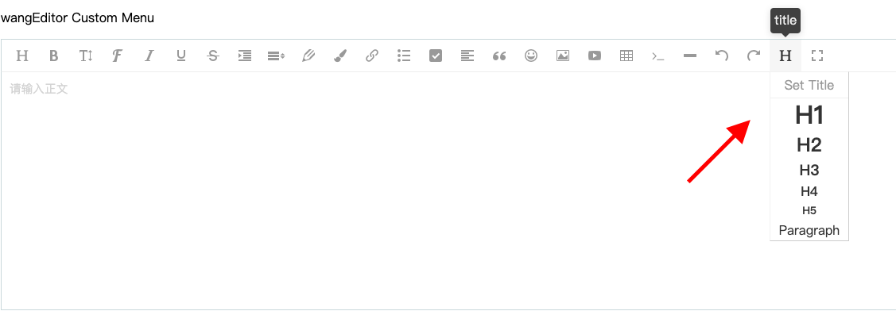

# DropList Menu

DropList menu, when the mouse is over the menu, the drop-down list will be displayed, as shown in the figure below.




The class code for developing a DropList menu is as follows. In addition, the registration menu is the same as the process above and will not be repeated.

```
// The class of the title menu can be used as a reference code for the DropList menu
class Head extends DropListMenu {
    constructor(editor) {
        // DOM element of the title menu in the menu bar
        // Note that the $ here is not jQuery, but E.$ (the DOM manipulation tool that comes with wangEditor, similar to jQuery)
        // The data-title attribute indicates a brief description of the function of the button when the mouse hovers over the button
        const $elem = $('<div class="w-e-menu" data-title="Title"><i class="w-e-icon-header"></i></div>')

        // droplist conf
        const dropListConf = {
            width: 100,
            title: 'Set Title',
            type: 'list',
            list: [
                { $elem: $('<h1>H1</h1>'), value: '<h1>' },
                { $elem: $('<h2>H2</h2>'), value: '<h2>' },
                { $elem: $('<h3>H3</h3>'), value: '<h3>' },
                { $elem: $('<h4>H4</h4>'), value: '<h4>' },
                { $elem: $('<h5>H5</h5>'), value: '<h5>' },
                { $elem: $('<p>Paragraph</p>'), value: '<p>' },
            ],
            // The click event of each item in the droplist
            clickHandler: (value) => {
                // The value parameter is the value configured in dropListConf.list
                this.command(value)
            },
        }

        super($elem, editor, dropListConf)
    }

    command(value) {
        // set title
        this.editor.cmd.do('formatBlock', value)
    }

    // if the menu need to be activated
    tryChangeActive() {
        const reg = /^h/i
        const cmdValue = this.editor.cmd.queryCommandValue('formatBlock')
        if (reg.test(cmdValue)) {
            // The selection is in the title, activate the menu
            this.active()
        } else {
            // Otherwise, unActive
            this.unActive()
        }
    }
}
```