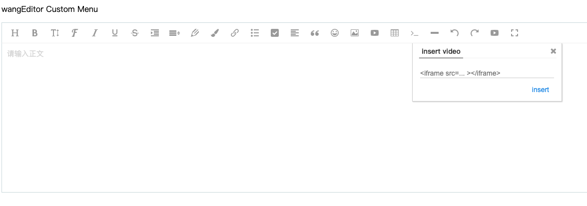

# Pancel Menu 

Panel menu, when you click the menu, the panel will pop up, as shown in the figure below.

To develop a Panel menu, you can directly refer to the source code of [the video menu](https://github.com/wangeditor-team/wangEditor/tree/master/src/menus/video), which is easier to understand. Pay attention to the source code:

* Ignore the type of typescript
* Ignore MenuActive in index.ts
* Ignore the getRandom method in create-panel-conf.ts, just define the string yourself
* In short, check the main process and don’t be affected by unimportant things

the registration menu is the same as the process above and will not be repeated.