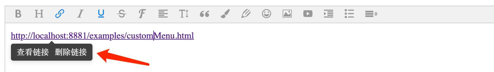

# Custom Tooltip

In the editing area, you can use tooltip to achieve more complex operations, such as the link in the figure below, you can use tooltip to view and delete links.

To customize the tooltip, you can refer to the [link tooltip](https://github.com/wangeditor-team/wangEditor/tree/master/src/menus/link/bind-event) source code. Execute the bindEvent function in `index.ts` before editor.create().

`editor.txt.eventHooks` is needed to implement the tooltip, please check the next section.